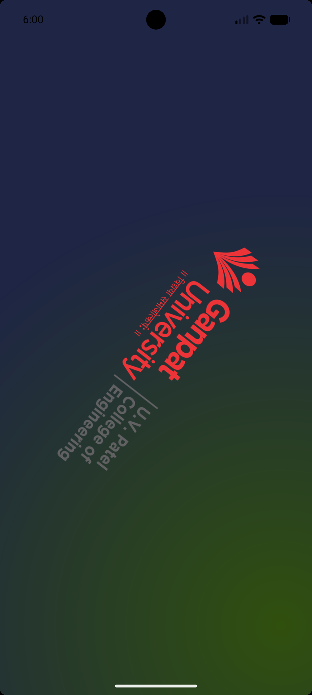
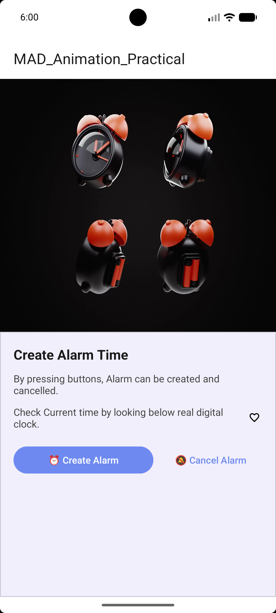

# MAD Practical 6: Frame-by-Frame & Tween Animation Application

[](https://developer.android.com)
[](https://kotlinlang.org)
[](https://gradle.org)
[-brightgreen)](https://developer.android.com/tools/releases/platforms)

## 🎯 Aim
> **Create Android Application to demonstrate Frame by frame animation and splash screen to demonstrate twin animation.**

---

## 👤 Submission Details
* **Submitted by:** Nishit Patel
* **Enrollment Number:** 24012011115
* **Subject:** Mobile Application Development (MAD)
* **Institute:** U. V. Patel College of Engineering (UVPCE), Ganpat University

---

## 📱 Project Overview

**MAD Practical 6** is an Android application designed to demonstrate the complete implementation and lifecycle handling of **Frame-by-Frame Animations** and **Tween Animations** in modern Android development.

The application integrates key Android animation and UI frameworks:
- **`AnimationDrawable` (Frame-by-Frame Animation):** Creates illusion of motion through rapid sequential display of drawable frames, utilized for the multi-part UVPCE college logo on the splash screen, a 10-frame ringing alarm clock, and dynamic heart status indicator.
- **`Animation` & `AnimationUtils` (Tween Animation):** Applies algorithmic geometric transformations (rotation) via XML animation sets to smoothly rotate the branding element 360 degrees.
- **`Animation.AnimationListener`:** Orchestrates seamless activity transitions by capturing animation termination callbacks to launch the dashboard screen automatically.
- **Lifecycle-Safe Animation Control:** Leverages `onWindowFocusChanged()` to ensure animations start reliably after views are fully rendered and stop when unfocused to conserve battery and system memory.
- **Material 3 UI:** Incorporates `MaterialCardView`, rounded action buttons, edge-to-edge system insets compatibility, and custom radial gradient styling.

---

## 📸 Screenshots & UI Flow

<table align="center">
  <tr>
    <th align="center">1. Splash Screen</th>
    <th align="center">2. Splash Screen 2</th>
    <th align="center">3. Main Screen (Alarm Ringing) &amp; Controls</th>
  </tr>
  <tr>
    <td align="center">
      
    </td>
    <td align="center">
      
    </td>
    <td align="center">
      
    </td>
  </tr>
  <tr>
    <td align="center">UVPCE logo frame animation with 360° twin rotation</td>
    <td align="center">Continuous 10-frame ringing alarm clock animation</td>
    <td align="center">Material 3 card with animated heart &amp; action buttons</td>
  </tr>
</table>

---

### Detailed Component Roles

1. **`SplashActivity.kt`**:
   - **Dual Animation Binding**: Binds [`uvpce_animation_list.xml`](app/src/main/res/drawable/uvpce_animation_list.xml) to `imgLogo.background` as an `AnimationDrawable` and loads [`twinanimation.xml`](app/src/main/res/anim/twinanimation.xml) via `AnimationUtils.loadAnimation()`.
   - **Lifecycle Management**: Starts both animations on `onWindowFocusChanged(hasFocus = true)` and stops frame cycling when window focus is lost.
   - **Screen Transition Listener**: Implements `Animation.AnimationListener`; inside `onAnimationEnd()`, automatically executes an explicit `Intent` navigating the user to `MainActivity`.
   - **Edge-to-Edge Experience**: Integrates `enableEdgeToEdge()` and `WindowInsetsCompat` for modern status and navigation bar insets handling.

2. **`MainActivity.kt`**:
   - **Alarm Frame Animation**: Binds [`alarm_frame_anim.xml`](app/src/main/res/drawable/alarm_frame_anim.xml) to `ivAlarm.background` as an `AnimationDrawable` (10 consecutive frames, 100ms each, infinitely looped).
   - **Heart Indicator Animation**: Binds [`ic_heart_outline.xml`](app/src/main/res/drawable/ic_heart_outline.xml) to `ivHeart.background` as an `AnimationDrawable` (5 sequential fill stages from 0% to 100% fill, 200ms each).
   - **Window Focus Handling**: Safely calls `alarmFrameAnimation.start()` and `heartPulseAnimation.start()` when `hasFocus == true`, and `stop()` when leaving the screen.

3. **`twinanimation.xml` (Tween Animation)**:
   - Defined in `res/anim/` using an XML `<set>` container with `@android:anim/accelerate_decelerate_interpolator`.
   - Applies a smooth `<rotate>` transformation from `0°` to `360°` around the center pivot point (`pivotX="50%"`, `pivotY="50%"`) over a duration of 2500ms with `fillAfter="true"`.

4. **`alarm_frame_anim.xml` & `uvpce_animation_list.xml` (Frame Animation)**:
   - Defined in `res/drawable/` using `<animation-list>`:
     - `alarm_frame_anim.xml`: Configured with `oneshot="false"` for continuous ringing clock motion across 10 bitmap frames.
     - `uvpce_animation_list.xml`: Configured with `oneshot="true"` for a single-pass progressive logo rendering sequence.

5. **Layouts (`activity_splash.xml` & `activity_main.xml`)**:
   - Built cleanly with `ConstraintLayout`.
   - `activity_splash.xml` uses a custom radial background gradient (`rectangle_gradient.xml`).
   - `activity_main.xml` utilizes a bottom `MaterialCardView` holding title, description labels, animated heart icon, and Material 3 styled buttons (`btnCreateAlarm`, `btnCancelAlarm`).

---

## 🎞️ Animation Architecture & Technical Breakdown

| Animation Resource | Type | Format | Key Properties & Behavior |
| :--- | :--- | :--- | :--- |
| **`twinanimation.xml`** | **Tween Animation** | XML `<set>` | Rotates `0°` to `360°`, `duration="2500ms"`, `pivotX/Y="50%"`, accelerate-decelerate interpolation. |
| **`heart_pulse.xml`** | **Tween Animation** | XML `<set>` | Scale transform (`1.0` to `1.3`), `duration="600ms"`, `repeatMode="reverse"`, `repeatCount="infinite"`. |
| **`uvpce_animation_list.xml`** | **Frame-by-Frame** | XML `<animation-list>` | One-shot (`oneshot="true"`), 8 sequential UVPCE logo stages at 100ms-200ms intervals. |
| **`alarm_frame_anim.xml`** | **Frame-by-Frame** | XML `<animation-list>` | Continuous loop (`oneshot="false"`), 10 sequential alarm images (`alarm1`–`alarm10`) at 100ms intervals. |
| **`ic_heart_outline.xml`** | **Frame-by-Frame** | XML `<animation-list>` | Continuous loop (`oneshot="false"`), 5 stages (`ic_heart_0` to `ic_heart_100`) at 200ms intervals. |

---

## 🚀 Getting Started & Installation

### 1. Clone the Repository
Open your terminal or command prompt and run:

```bash
git clone https://github.com/Nishit079/24012011115_MAD_Practical-6.git
```

### 2. Open in Android Studio
1. Launch **Android Studio** (Ladybug, Koala, Jellyfish, or newer recommended).
2. Select **Open** and navigate to the cloned folder `24012011115_MAD_Practical-6`.
3. Allow Android Studio to complete Gradle sync and download required dependencies.

### 3. Build and Run
1. Connect an Android physical device (via USB or Wi-Fi debugging) or start an Android Virtual Device (AVD with API 24+).
2. Select the `app` configuration from the run options.
3. Click the green **Run** (`Shift + F10`) button in Android Studio.

---

## 🛠️ Tech Stack & Dependencies

* **Language:** Kotlin
* **UI Framework:** Android XML Layouts with Material Components (Material 3)
* **Minimum SDK:** API 24 (Android 7.0 Nougat)
* **Target SDK:** API 37
* **Android Gradle Plugin (AGP):** 9.3.2
* **Key Libraries:**
  - `androidx.core:core-ktx:1.19.0`
  - `androidx.appcompat:appcompat:1.8.0`
  - `com.google.android.material:material:1.14.0`
  - `androidx.activity:activity-ktx:1.13.0`
  - `androidx.constraintlayout:constraintlayout:2.2.2`

---

## 👤 Author & Submission Information

* **Submitted by:** Nishit Patel
* **Enrollment Number:** 24012011115
* **Subject:** Mobile Application Development (MAD)
* **Repository Link:** [https://github.com/Nishit079/24012011115_MAD_Practical-6](https://github.com/Nishit079/24012011115_MAD_Practical-6)
